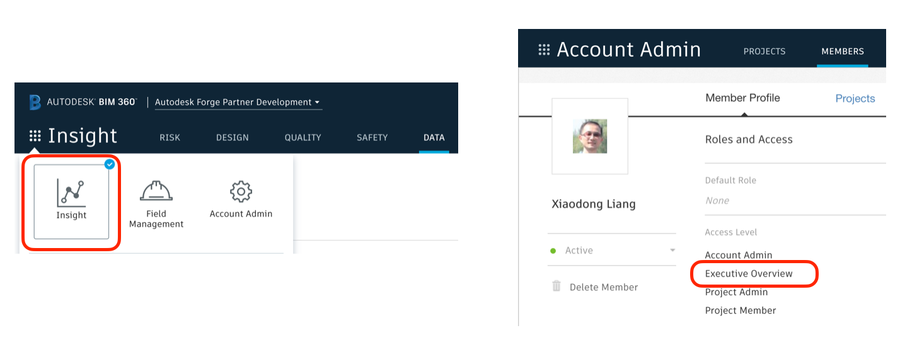

# Dashboard Sample of BIM 360 Data Connector API

[](https://nodejs.org/)
[](https://www.npmjs.com/)

[](https://forge.autodesk.com/en/docs/data/v2/reference/http/)

[](https://forge.autodesk.com/en/docs/bim360/v1/reference/http/)
[](https://forge.autodesk.com/en/docs/bim360/v1/overview/field-guide/data-connector/)

[](http://opensource.org/licenses/MIT)
[](http://developer.autodesk.com/)

## Description
This sample demonstrates the following use cases:

* Export requests with their service groups schedule interval, reoccurring interval and their jobs, status. 
* Get data list of a complete job
* Get data content and render dashboards. Current version only demos some dashboards of with BIM360 Issue data. You can extend the sample with dashboards for other data.
* Create new request with any type of schedule interval and service groups.

  
## Thumbnail
  

## Demonstration
[](https://youtu.be/sJmeiK3xYTU "Dashboard Sample of BIM 360 Data Connector API")

## Live Demo
https://bim360-data-connect-dashboard.herokuapp.com/#

# Web App Setup

## Prerequisites

1. **Forge Account**: Learn how to create a Forge Account, activate subscription and create an app at [this tutorial](http://learnforge.autodesk.io/#/account/). 
2. **BIM 360 Account**: must be Account Admin to add the app integration. [Learn about provisioning](https://forge.autodesk.com/blog/bim-360-docs-provisioning-forge-apps). 
3. **BIM 360 Data Connector**: Ensure Account Insight is available and the user is Account Executive. Check [product help]( https://knowledge.autodesk.com/support/bim-360/learn-explore/caas/CloudHelp/cloudhelp/ENU/BIM360D-Insight/files/BIM360D-Insight-data-extractor-html-html.html) for more
      
4. **Node.js**: basic knowledge with [**Node.js**](https://nodejs.org/en/).
5. **JavaScript** basic knowledge with **jQuery**, **Chart.js** and other basic 
6. **ngrok**: Routing tool, [download here](https://ngrok.com/)


For using this sample, you need an Autodesk developer credentials. Visit the [Forge Developer Portal](https://developer.autodesk.com), sign up for an account, then [create an app](https://developer.autodesk.com/myapps/create). For this new app, use **http://localhost:3000/oauth/callback** as Callback URL. Finally take note of the **Client ID** and **Client Secret**.

## Running locally

Install [NodeJS](https://nodejs.org), version 12 or newer. The older version of Node.js may also work, but not tested..

Clone this project or download it (this `nodejs` branch only). It's recommended to install [GitHub desktop](https://desktop.github.com/). To clone it via command line, use the following (**Terminal** on MacOSX/Linux, **Git Shell** on Windows):

    git clone https://github.com/autodesk-forge/forge-bim360-data.connector.dashboard

Install the required packages using `npm install`.

**ngrok**

Run `ngrok http 3000 -host-header="localhost:3000"` to create a tunnel to your local machine, then copy the address into the `FORGE_WEBHOOK_URL` environment variable.

**Environment variables**

Set the enviroment variables with your Forge client id & secret, forge callback url (to get 3-legged token from user logging) and Data Connector callback url (DC_CALLBACK_URL). [Callback of Data Connector API](/server/endpoints/job_callback.js) is one payload parameter when creating one Data Connector Request. It will will trigger when a job completes, or fails, telling the request id, job id etc. You can decide what you want to do with the sample, or with your own sample.  Via command line, navigate to the folder where this repository was cloned and use the following:

Mac OSX/Linux (Terminal)

    npm install
    export FORGE_CLIENT_ID=<<YOUR CLIENT ID FROM DEVELOPER PORTAL>>
    export FORGE_CLIENT_SECRET=<<YOUR CLIENT SECRET>>
    export FORGE_CALLBACK_URL=<<your callback url of Forge e.g. http://localhost:3000/oauth/callback>>
    export DC_CALLBACK_URL=<<"your ngrok address here: e.g. http://abcd1234.ngrok.io/job/callback">>

    npm start

Windows (use **Node.js command line** from Start menu)

    npm install
    set FORGE_CLIENT_ID=<<YOUR CLIENT ID FROM DEVELOPER PORTAL>>
    set FORGE_CLIENT_SECRET=<<YOUR CLIENT SECRET>>
    set FORGE_CALLBACK_URL=<<your callback url of Forge e.g. http://localhost:3000/oauth/callback>>
    set DC_CALLBACK_URL=<<"your ngrok address here: e.g. http://abcd1234.ngrok.io/job/callback">>


**Set Socket host at client side** 
Define the socket endpoint same to your host at [this line](/public/js/socket_modules.js#L11), e.g.
```
socketio = io('http://localhost:3000');  
```

Finally run the script to start the sample

    npm start

OR, set environment variables of [launch.json](/.vscode/launch.json) for debugging.

```json
"env": {
    "FORGE_CLIENT_ID": "your id here",
    "FORGE_CLIENT_SECRET": "your secret here",
    "FORGE_CALLBACK_URL": "http://localhost:3000/oauth/callback",
    "DC_CALLBACK_URL": "your ngrok address here: e.g. http://abcd1234.ngrok.io/job/callback"
},
``` 

## Use Cases

1. Open the browser: [http://localhost:3000](http://localhost:3000). Please watch the [Video](https://youtu.be/sJmeiK3xYTU) for the detail and usage the steps.

2. After the user logging succeeds, select a hub. The code will start to extract all requests, and display them in table view.  It will show the basic information of the request such as their service groups, schedule interval, reoccurring interval and their jobs, status.

3. If the request is ONE_TIME, it has only one job. If other types, it may have jobs list, select specific job, the status column will indicate if it completes or not.

4. Click one request,  the sample will get data list of the selected job of this request. All the data files will be listed in Data List view. It depends on how many service groups that are extracted. Click **download** icon of the file, it will download the file (csv) to local.

5. To demo the data analysis, this sample produces dashboards with Issue data, so there is another icon ** tachometer** with Issues-Issues.csv.  Click this icon, it will generate some dashboards with Issue data. Since some issue data is Id only (such as project id, user id), the code behind actually takes advantage of Admin data.   

6. To create a new request, configure the service groups,  schedule interval, reoccurring interval, and execute from date, and end date (if schedule interval is not ONE_TIME). Click **Create Request** button, it will create a new request and refresh the table view. 

7. At the beginning right after a new request is created, no job yet. So the job list is empty. Since the job of ONE_TIME will start immediately, the sample will poll status of job list. When it is available, it will notify client side by socket, and refresh the job list of table view. 
As to other type than ONE_TIME, the execute start time may not happen soon, so the sample does not check job list. The user will have to click hub after some time, depending on when the execute start time will be.
 
## Deployment

To deploy this application to Heroku, the **Callback URL** for Forge must use your `.herokuapp.com` address. After clicking on the button below, at the Heroku Create New App page, set your Client ID, Secret and Callback URL for Forge.

[](https://heroku.com/deploy?template=https://github.com/autodesk-forge/forge-bim360-data.connector.dashboard)

## Limitation
1. The sample also place a hold with [Callback feature of Data Connector API](/server/endpoints/job_callback.js). The callback will triggered when a job completes, or fails. You can decide what you want to do with the sample, or with your own sample. 


## Tips & Tricks

* DC API supports 3-legged token only. And the user must have Admin Executive permission. 
* DC API supports callback to get notification when one job is done, in which it will tell request id and job id.  
* Extracted data is stored on AWS for 30 days. If you do not want to extract the data of specific time again, ensure to download the data to your own database within 30 days.
* When a request is newly created, it may take a few minutes API could return the jobs list.
* Be careful not to set effectiveFrom, effectiveTo to the past time when you create request.
* If a request is created in UI (Insight>>Data), the default description will be _IQ Data Extraction for <BIM360 Account ID>_. To make a shorter string in table view, this sample changes the description to _Extraction by UI_

## Troubleshooting
1. **Cannot see my BIM 360 hub**: Make sure to provision the Forge App Client ID within the BIM 360 Account, [learn more here](https://forge.autodesk.com/blog/bim-360-docs-provisioning-forge-apps). This requires the Account Admin permission.
 
## Further Reading
**Document**
- [Data Connector Field Guid](https://forge.autodesk.com/en/docs/bim360/v1/overview/field-guide/data-connector/)
- [Data Connector API Reference](https://forge.autodesk.com/en/docs/bim360/v1/reference/http/data-connector-requests-POST/)

**Tutorials**:
- [Data Connector Tutorial](https://forge.autodesk.com/en/docs/bim360/v1/tutorials/data-connector/)
- [Data Connector Postman Collection](https://github.com/autodesk-forge/forge-bim360-data.connector.api-postman.collection)

**Blogs**:
- [Forge Blog](https://forge.autodesk.com/categories/bim-360-api)
- [Field of View](https://fieldofviewblog.wordpress.com/), a BIM focused blog

## License
This sample is licensed under the terms of the [MIT License](http://opensource.org/licenses/MIT). Please see the [LICENSE](LICENSE) file for full details.

## Written by
Xiaodong Liang [@coldwood](https://twitter.com/coldwood), [Forge Advocate and Support](http://forge.autodesk.com)


